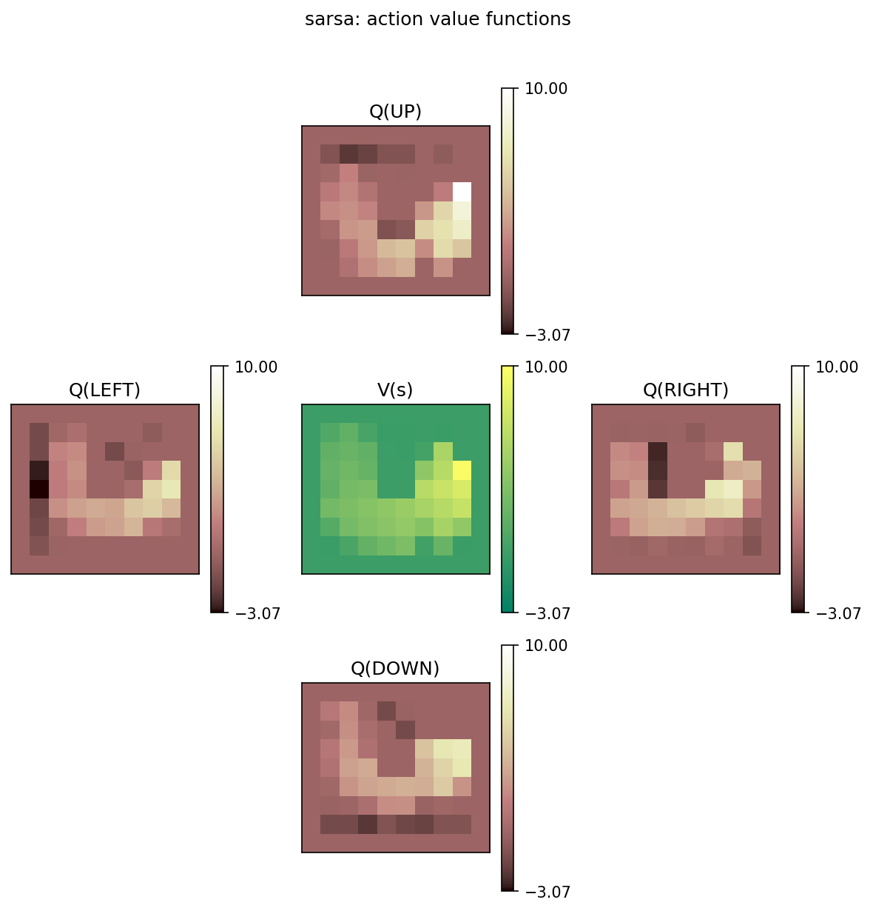
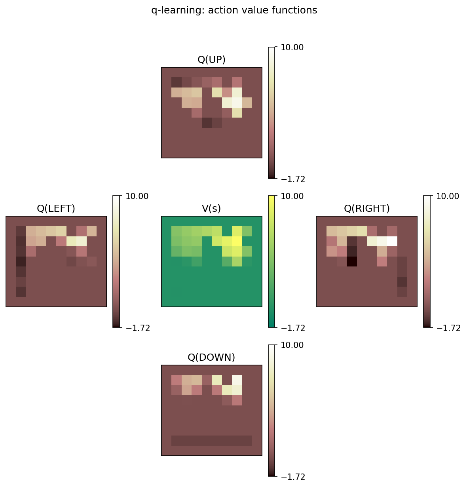
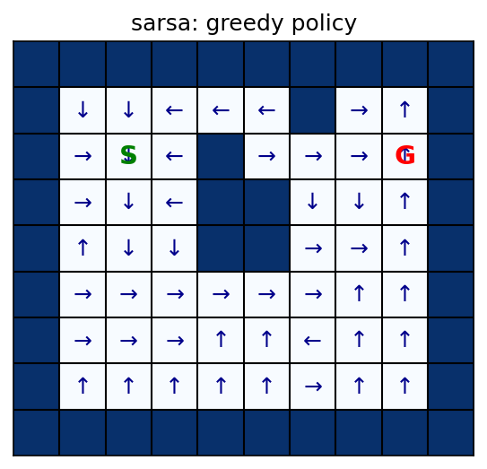
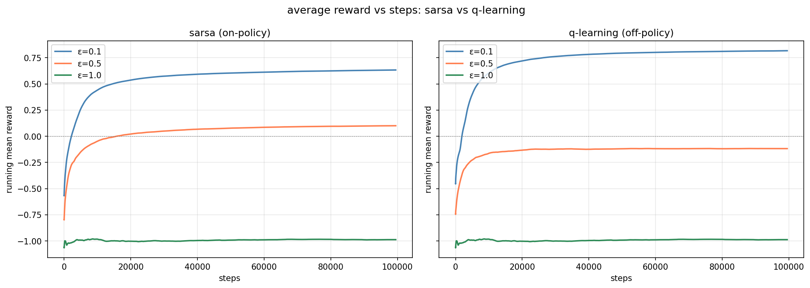
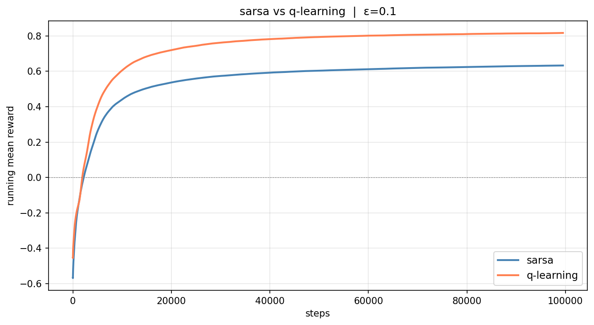

# cisc 856 assignment 3 — implementing and analyzing td algorithms

elsayed elmandouh - 20596379 - reinforcement learning - queen's university

[](https://github.com/elsayedelmandoh/cisc-856-assignment-3)
[](https://x.com/aangpy)
[](https://www.linkedin.com/in/elsayed-elmandoh-b5849a1b8/)

---

## table of contents

- [overview](#overview)
- [gridworld environment](#gridworld-environment)
- [algorithms](#algorithms)
- [setup](#setup)
- [usage](#usage)
- [project structure](#project-structure)
- [results](#results)
- [report](#report)
- [author](#author)

---

## overview

Implementation and analysis of two fundamental TD control algorithms **SARSA** (on-policy) and **Q-learning** (off-policy) in a 10×9 gridworld environment with walls, a start state, and a goal state.

### algorithms implemented

| algorithm | type | update rule |
|-----------|------|-------------|
| **SARSA** | on-policy TD control | `Q(s,a) += α[r + γ Q(s',a') – Q(s,a)]` |
| **Q-learning** | off-policy TD control | `Q(s,a) += α[r + γ max<sub>a'</sub> Q(s',a') – Q(s,a)]` |

---

## gridworld environment

A 10-column × 9-row grid with wall cells (-1), empty cells (0, reward 0), and a single goal cell (+10). The agent starts at the top-left interior and must navigate around walls to reach the goal. Bumping into a wall incurs a penalty of -5 and the agent stays in place. Reaching the goal yields +10 and resets to the start state.

- **states** — each (row, col) position on the grid
- **actions** — up (0), right (1), down (2), left (3)
- **rewards** — -5 for walls, +10 for goal, 0 otherwise
- **discount factor** — γ = 0.9
- **grid layout** (9 rows × 10 cols):

```
-1 -1 -1 -1 -1 -1 -1 -1 -1 -1
-1  S  .  .  .  . -1  .  . -1
-1  .  .  . -1  .  .  .  G -1
-1  .  .  . -1 -1  .  .  . -1
-1  .  .  . -1 -1  .  .  . -1
-1  .  .  .  .  .  .  .  . -1
-1  .  .  .  .  .  .  .  . -1
-1  .  .  .  .  .  .  .  . -1
-1 -1 -1 -1 -1 -1 -1 -1 -1 -1
```

---

## algorithms

### SARSA (on-policy)

At each step the agent picks action *A'* from *S'* using the **same** ε-greedy policy. The update then uses *Q(S', A')* — the value of the action actually taken next. Because both the behaviour and target policies are identical, SARSA learns action values conditioned on exploration.

### Q-learning (off-policy)

The update uses **max<sub>a'</sub> Q(S', a')** — the greedy value of the best action from *S'*, regardless of what the agent actually does next. The behaviour policy remains ε-greedy (for exploration), but the target is always greedy. This decoupling lets Q-learning converge to the optimal Q* even while exploring.

---

## setup

```bash
# clone repository
git clone https://github.com/elsayedelmandoh/cisc-856-assignment-3
cd cisc-856-assignment-3

# create environment
conda create -n cisc856 python=3.12 -y
conda activate cisc856

# install dependencies
pip install -r requirements.txt
```

---

## usage

```bash
# run main program (generates figures + prints q-tables)
python app.py

# or open the notebook
jupyter notebook notebooks/01-assignment-3.ipynb
```

### generated outputs

| file | description |
|------|-------------|
| `docs/02-results/sarsa_q_values.png` | action-value functions learned by SARSA |
| `docs/02-results/sarsa_policy.png` | greedy policy extracted from SARSA Q-table |
| `docs/02-results/qlearning_q_values.png` | action-value functions learned by Q-learning |
| `docs/02-results/qlearning_policy.png` | greedy policy extracted from Q-learning Q-table |
| `docs/02-results/td_epsilon_comparison.png` | average reward vs steps for ε ∈ {0.1, 0.5, 1.0} |
| `docs/02-results/td_sarsa_vs_qlearning.png` | direct SARSA vs Q-learning comparison at ε = 0.1 |

---

## project structure

```
cisc-856-assignment-3/
├── app.py                      # main execution & plotting
├── README.md
├── requirements.txt            # dependencies
├── .env.example                # config template
├── .env                        # local config
├── .gitignore
├── src/
│   ├── config/
│   │   └── config.py           # pydantic settings (alpha, gamma, epsilons, etc.)
│   └── utils/
│       ├── environment.py      # Grid world, Action enum, run_experiment
│       ├── sarsa_agent.py      # SARSA agent (on-policy TD control)
│       ├── q_learning_agent.py # Q-learning agent (off-policy TD control)
│       ├── rewards.py          # epsilon comparison & plotting
│       └── visualizations.py   # value/policy visualization helpers
├── notebooks/
│   └── 01-assignment-3.ipynb   # notebook version (imports from src/)
└── docs/
    ├── 01-assignment/          # assignment spec (pdf + md)
    ├── 02-results/             # generated figures
    └── 03-deliverables/
        ├── 01-report.md        # full report
        ├── 01-report.pdf
        ├──2-ai-usage.md        # AI usage disclosure
        └── 02-ai-usage.pdf
```

---

## results

### single-run reward (ε = 0.1, 100k steps)

| algorithm | mean reward |
|-----------|-------------|
| SARSA     | 0.56        |
| Q-learning | 0.94       |

Q-learning achieves higher average reward because its off-policy update converges to the optimal Q* directly, while SARSA's on-policy update learns a policy that remains exploration-conditioned.

### epsilon comparison

The epsilon-sweep experiment (ε = 0.1, 0.5, 1.0) reveals:

- **ε = 0.1** - best overall performance for both algorithms. Low exploration means the agent spends most of its time exploiting learned values, leading to faster convergence and higher reward.
- **ε = 0.5** - moderate exploration slows convergence. The agent takes random actions half the time, accumulating more wall penalties.
- **ε = 1.0** - fully random behaviour. Neither algorithm can converge meaningfully; reward hovers near zero.

### figures

| SARSA action-values | Q-learning action-values |
|:---:|:---:|
|  |  |

| SARSA policy | Q-learning policy |
|:---:|:---:|
|  |  |

| epsilon comparison | SARSA vs QL |
|:---:|:---:|
|  |  |

---

## report

full report at [`docs/03-deliverables/01-report.pdf`](docs/03-deliverables/01-report.pdf).

---

## author

elsayed elmandoh - nlp engineer - [linktree](https://linktr.ee/elsayedelmandoh)

