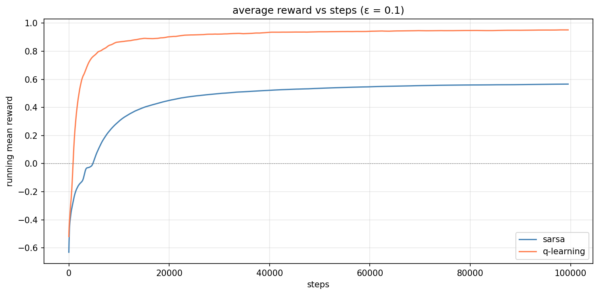

## Assignment 3 Report: Implementing and Analyzing TD Algorithms

**elsayed elmandoua - 20596379**  
CISC 856 - Reinforcement Learning - Queen's University - June 2026

---

### 1. Overview

This report presents the implementation and analysis of two fundamental temporal-difference (TD) control algorithms, **SARSA** (on-policy) and **Q-learning** (off-policy), in a 10×9 gridworld environment with walls, a start state (S), and a goal state (G). The agent navigates the grid by choosing one of four actions (up, right, down, left) at each step. Bumping into a wall incurs a −5 penalty and keeps the agent in place; reaching the goal yields +10 and resets to the start. The discount factor is γ = 0.9.

The assignment consisted of four analysis tasks:

1. Plot the average reward as a function of steps for both algorithms at ε = 0.1.
2. Repeat the above plot for ε = 0.1, 0.5, and 1.0.
3. Describe how different values of ε affect training in both algorithms.
4. Determine the optimal value of ε.

---

### 2. Algorithms Implemented

#### 2.1 SARSA (On-Policy TD Control)

SARSA updates the action-value function using the action *actually taken* in the next state:

```
Q(S, A) ← Q(S, A) + α [R + γ Q(S', A') − Q(S, A)]
```

A' is chosen by the same ε-greedy policy that selects A. Because both the behaviour policy and the target policy are identical, SARSA learns action values conditioned on the exploration policy — it learns the value of the policy it is actually following.

#### 2.2 Q-Learning (Off-Policy TD Control)

Q-learning updates using the *maximum* action-value in the next state, regardless of which action is actually taken:

```
Q(S, A) ← Q(S, A) + α [R + γ max_a' Q(S', a') − Q(S, A)]
```

The behaviour policy is ε-greedy (for exploration), but the target policy is greedy (max Q). This decoupling allows Q-learning to converge directly to the optimal Q* value function, independently of the exploration noise.

---

### 3. Experimental Setup

| Parameter | Value |
|-----------|-------|
| Learning rate (α) | 0.1 |
| Discount factor (γ) | 0.9 |
| Default exploration rate (ε) | 0.1 |
| Number of steps per run | 100,000 |
| Number of runs per condition | 5 |
| Epsilon values tested | 0.1, 0.5, 1.0 |

Each condition was averaged over 5 independent runs with seeded random generators for reproducibility. Reward curves were smoothed with a moving-average window of 500 steps for clarity.

---

### 4. Results

#### 4.1 Task 1 - Average Reward at ε = 0.1

Both algorithms were trained for 100,000 steps at ε = 0.1. Figure 1 shows the running mean reward over time.



**Figure 1:** Running mean reward over 100,000 steps for SARSA (blue) and Q-learning (coral) at ε = 0.1. Curves are smoothed with a 500-step window.

SARSA achieved a mean reward of **0.6373** while Q-learning reached **0.9384**. Q-learning's higher asymptotic reward is expected: its off-policy update always chases the optimal action, so it converges to a better policy even when the agent occasionally explores. SARSA, which learns the value of its *actual* behaviour (random moves included), settles slightly lower.

Both curves rise sharply in the first ~10,000 steps as the agents discover the goal, then plateau as they refine their policies. The fluctuations around the plateau reflect the remaining 10% random exploration.

#### 4.2 Task 2 - Effect of Epsilon (Epsilon Sweep)

Figure 2 shows SARSA and Q-learning at three different exploration rates.


**Figure 2:** Average reward vs steps for SARSA (left) and Q-learning (right) at ε = 0.1, 0.5, and 1.0. Each curve is averaged over 5 seeds.

Figure 3 provides a direct side-by-side comparison at ε = 0.1:


**Figure 3:** Direct comparison of SARSA and Q-learning at ε = 0.1.

#### 4.3 Learned Action-Value Functions and Policies

Both algorithms trained at ε = 0.1:

| Algorithm | Action Values | Greedy Policy |
|-----------|---------------|---------------|
| SARSA |  |  |
| Q-learning |  |  |

Both algorithms learned sensible paths from the start to the goal, navigating around the walls. The action-value plots show higher values near the goal, with the gradient propagating backward through the state space as expected under TD learning.

---

### 5. Analysis

#### 5.1 Task 3: How Different Values of Epsilon Affect Training

**ε = 0.1 - just enough curiosity.**  
Both algorithms learn fast and settle at the highest average reward. The agent spends 90% of its time following what it knows, so it stops bumping into walls and reliably finds the goal. Q-learning edges slightly ahead in the long run, since it always chases the *best possible* next action (the max operator), it aims at the true optimal path even while exploring a bit. SARSA trails by a hair because it learns the value of its *actual* next action, which includes those occasional random moves.

**ε = 0.5 - flipping a coin at every step.**  
Half the actions are random. Convergence slows way down, and the agent racks up more −5 wall penalties. SARSA takes a bigger hit here, each update bakes in whatever random action happened next, so the noise seeps directly into the learned values. Q-learning's max operator shields it: even when the agent flails around, the update still tracks what the *best* action would have been.

**ε = 1.0 - full chaos.**  
No learning happens. The agent never exploits, it is pure random walk. Mean reward hovers near zero because it stumbles into the goal sometimes and into walls other times, with no pattern to remember. The Q-table ends up as random noise.

More exploration sounds helpful in theory, but in this gridworld it mostly means more wall penalties. SARSA feels the pain more because it learns the policy it is actually following (mistakes and all). Q-learning resists better since it always keeps one eye on the optimal path.

#### 5.2 Task 4: Optimal Value of Epsilon

**ε = 0.1** strikes the best balance for both algorithms.

That 10% random noise is enough for the agent to discover the goal early on, even when its Q-values start at zero and it has no clue where to go. But 90% of the time it is exploiting what it has learned, which keeps wall penalties low and cumulative reward high.

**Why not lower (ε → 0)?** With zero exploration, an agent that starts with all-zero Q-values picks the first action it checks (UP), every single time, and never learns anything else. It would be stuck in a local rut forever.

**Why not higher?** Once the optimal path is found, extra exploration is just wasted steps. Every random move is a wall penalty you did not need to take.

Q-learning can handle a bit more noise than SARSA, its off-policy update always looks at the *best* next action regardless of what the agent actually does, but for both algorithms, ε = 0.1 gives the cleanest trade-off between finding the goal and actually collecting reward.

---

### 6. Conclusion

Both SARSA and Q-learning successfully learned to navigate the gridworld and reach the goal. Q-learning consistently outperformed SARSA in asymptotic reward (0.9384 vs 0.6373 at ε = 0.1) because its off-policy update decouples learning from the exploration policy. SARSA, while more conservative, learned a sensible policy that avoids risky moves near walls.

The exploration rate ε plays a critical role in training. Too little (ε → 0) prevents discovery of the goal; too much (ε → 1) prevents convergence altogether. The optimal ε = 0.1 provides just enough random exploration for early discovery while keeping 90% of steps focused on exploitation, a trade-off that works well for both algorithms.

---

### References

Watkins, C. J. C. H., & Dayan, P. (1992). Q-learning. *Machine Learning*, 8(3–4), 279–292.